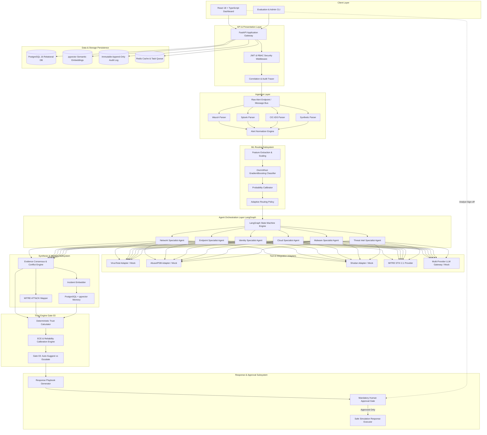
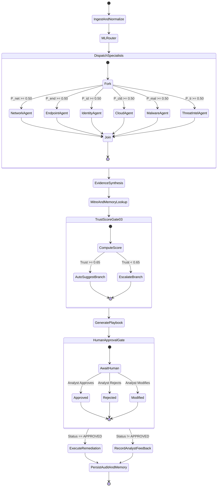
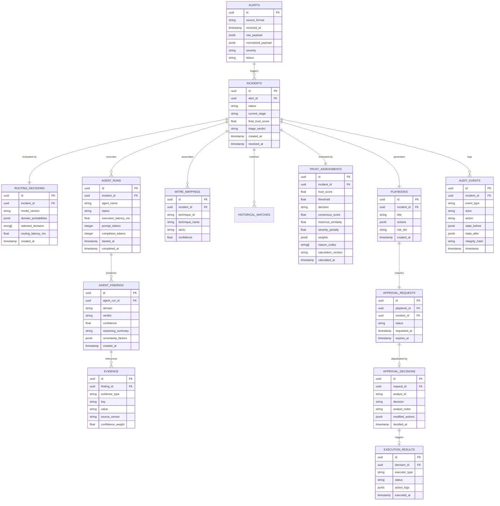

# System Architecture & Technical Design

**System Name:** Adaptive Trust-Aware SOC Multi-Agent Platform  
**Document Version:** 1.0.0  
**Architecture Pattern:** Clean / Hexagonal Architecture (Ports and Adapters)  

---

## 1. Architectural Principles

1. **Clean Separation of Concerns:** Domain logic (`src/domain`, `src/trust`, `src/synthesis`) is isolated from external frameworks, databases, and UI layers.
2. **Explicit Contracts over Implicit Inference:** All inter-agent and inter-module communications use strictly validated Pydantic schemas. Unstructured string passing between agents is prohibited.
3. **Deterministic Safety Boundaries:** Safety-critical decisions (Trust Score computation, Human Approval verification, Playbook execution gates) are implemented as deterministic, non-LLM Python algorithms.
4. **Portability & Testability:** All external integrations (LLMs, Vector DB, Threat Intel APIs, SIEMs) use the Adapter pattern with accompanying deterministic mock providers.

---

## 2. High-Level System Architecture



---

## 3. LangGraph Orchestration State Machine

The multi-agent workflow is modeled as a deterministic Directed Acyclic Graph (DAG) state machine using LangGraph.

### 3.1 State Schema (`InvestigationState`)

```python
class InvestigationState(TypedDict):
    incident_id: str
    normalized_alert: dict
    routing_decision: dict
    active_agents: list[str]
    agent_findings: dict[str, dict]
    consensus_assessment: Optional[dict]
    mitre_mappings: list[dict]
    historical_cases: list[dict]
    trust_assessment: Optional[dict]
    recommended_playbook: Optional[dict]
    approval_request: Optional[dict]
    execution_result: Optional[dict]
    audit_trail: list[dict]
    errors: list[str]
```

### 3.2 Graph Transitions & Control Flow



---

## 4. Database Schema & Relational Entity Model



---

## 5. Security & Safety Architectural Guarantees

1. **Non-Bypassable Backend Approval Gate:**
   The `ExecutionEngine` service accepts only an `ApprovalToken` signed with HMAC-SHA256 containing `decision_id`, `analyst_id`, and `playbook_hash`. Directly calling the execution endpoint without a valid, unexpired approval token results in HTTP 403 Forbidden.
2. **Deterministic Response Sandbox:**
   By default, the platform activates `SimulationExecutor`. Simulated actions mutate an isolated mock environment state and record detailed execution diffs without issuing destructive live system commands.
3. **Structured Agent Parsing:**
   All agent responses are validated against Pydantic models. Any LLM output failing schema validation triggers a retry or falls back to `INSUFFICIENT_DATA` with explicit human escalation.
4. **Append-Only Tamper-Aware Audit Ledger:**
   Every `AuditEvent` stores a cryptographic hash chaining to the preceding event hash ($H_n = \text{SHA256}(H_{n-1} \parallel \text{EventPayload}_n)$), enabling automated tamper detection.
