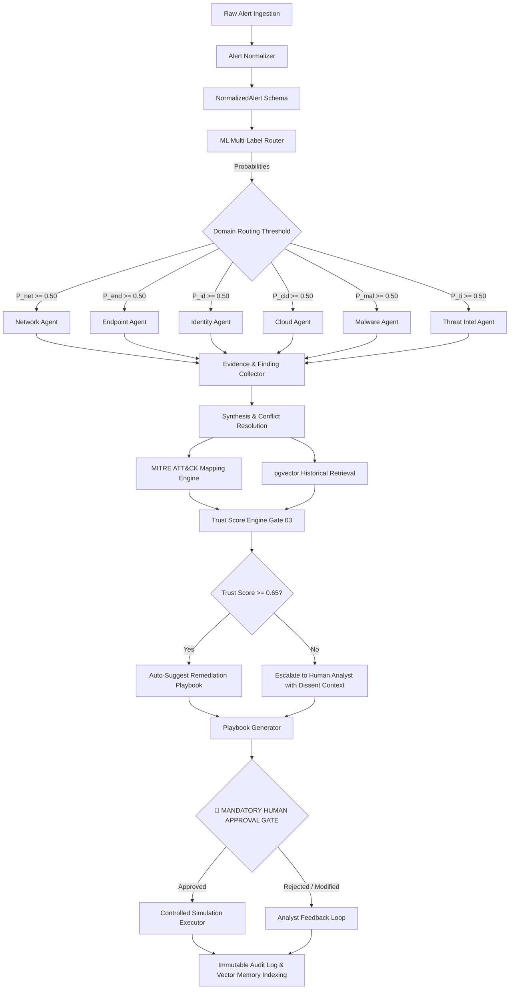

# Adaptive Trust-Aware Multi-Agent Framework — Project Specification

**Document Version:** 1.0.0  
**Status:** Approved Architectural Baseline  
**Classification:** Research Prototype & Patent Specification  
**Target Environment:** Python 3.11+ / FastAPI / LangGraph / PostgreSQL + pgvector / React + TypeScript

---

## 1. System Objective & Research Scope

### 1.1 Problem Statement
Enterprise SOCs suffer from alert fatigue (>10,000 alerts/day), high triage latency (mean MTTD > 45 minutes), and human cognitive burnout. Conventional automation (SOAR) relies on rigid, brittle rulebooks that fail under novel attack vectors. Conversely, unconstrained LLM agent frameworks suffer from unbounded token costs, hallucinated confidence, and dangerous lack of execution safety boundaries.

### 1.2 Proposed Solution
An **Adaptive Trust-Aware Multi-Agent Framework** that:
1. Employs a calibrated **Machine Learning Multi-Label Classifier** to dynamically route alerts exclusively to relevant domain specialists (Network, Endpoint, Identity, Cloud, Malware, Threat Intel), preventing unnecessary agent invocations.
2. Executes structured domain-specialist reasoning via **LangGraph**, producing typed findings tied to deterministic evidence.
3. Performs **evidence synthesis and explicit conflict detection**, surfacing contradictory agent findings rather than silently averaging them.
4. Integrates **pgvector-backed historical memory** to ground triage decisions in verified organizational precedent.
5. Computes a closed-form, deterministic **Trust Score $T \in [0, 1]$** combining consensus ($C$), historical precedent ($H$), and severity penalty ($S$).
6. Enforces a **Hard Architectural Human Approval Gate (Gate 03)** where remediation playbooks can only be executed in simulated/safe modes after explicit, cryptographically verifiable human authorization.

---

## 2. Pipeline Specification

---

## 3. Subsystem Detailed Requirements

### 3.1 Alert Ingestion & Normalization (`src/ingestion`)
- **Supported Ingestion Formats:**
  1. *Wazuh SIEM / OSSEC alerts* (JSON rule-based alerts, syscheck, rootcheck).
  2. *Splunk CIM-compliant events* (Authentication, Network Traffic, Endpoint Data Models).
  3. *CSE-CIC-IDS2018 / CICIDS2017 flow data* (Flow duration, packet length, flags, protocols).
  4. *Synthetic benchmark alerts* (Deterministic JSON test suites representing diverse attack scenarios).
- **Core Abstraction:** `AlertParser` interface with concrete parsers (`WazuhParser`, `SplunkParser`, `CICIDSParser`, `SyntheticParser`).
- **Normalized Contract:** Produces a strictly validated `NormalizedAlert` containing:
  - Global identifiers: `alert_id`, `source_format`, `timestamp`, `raw_payload`.
  - Network context: `src_ip`, `dst_ip`, `src_port`, `dst_port`, `protocol`, `dns_queries`.
  - Endpoint context: `hostname`, `process_name`, `process_path`, `command_line`, `parent_process`, `file_hashes` (SHA256, MD5).
  - Identity context: `user_name`, `user_id`, `domain`, `auth_type`, `mfa_status`.
  - Cloud context: `cloud_provider`, `account_id`, `region`, `resource_arn`, `api_call`.
  - Severity & Classification: `raw_severity`, `alert_category`, `signature`.

### 3.2 ML Multi-Label Expert Router (`src/routing`)
- **Objective:** For every `NormalizedAlert`, predict independent posterior probabilities $P(D_i \mid \text{alert})$ for domains $D \in \{\text{Network}, \text{Endpoint}, \text{Identity}, \text{Cloud}, \text{Malware}, \text{ThreatIntel}\}$.
- **Model Architecture:**
  - Feature Extractor: Hybrid TF-IDF vectorizer for categorical/textual command lines + scaled numerical metadata (ports, flow statistics, failure counts).
  - Classifier: `OneVsRestClassifier(GradientBoostingClassifier)` or `MultiOutputClassifier(HistGradientBoostingClassifier)`.
  - Probability Calibration: Isotonic Regression or Platt Scaling per binary classifier to guarantee calibrated posterior probabilities.
- **Routing Policy (`RouterPolicy`):**
  - Select domain $D_i$ if $P(D_i) \ge \tau_{\text{route}}$ (default $\tau_{\text{route}} = 0.50$, configurable).
  - Safety Invariant: If $\max_i P(D_i) < \tau_{\text{fallback}}$, invoke the top-2 highest probability specialists to avoid dropping ambiguous alerts.
- **Model Versioning & Tracking:**
  - Persist model binaries with SHA-256 hashes, hyperparameter metadata, training dataset lineage, and test metrics (Macro F1, Micro F1, Hamming Loss).

### 3.3 Specialist Domain Agents (`src/agents`)
- **Execution Engine:** LangGraph deterministic state nodes with structured JSON outputs.
- **Domain Specializations:**
  1. **Network Specialist:** Analyzes traffic volume, protocol anomalies, beaconing cadence, port-scan patterns, GeoIP anomalies, DNS tunneling.
  2. **Endpoint Specialist:** Reconstructs process ancestry trees, detects LOLBAS (Living-off-the-Land Binaries), examines privilege escalation flags, script block logs, registry persistence.
  3. **Identity Specialist:** Evaluates impossible travel (geo-velocity), brute-force authentication spikes, MFA bypass patterns, abnormal privilege assignment, dormant account activation.
  4. **Cloud Specialist:** Investigates CloudTrail/audit anomalies, abnormal AssumeRole patterns, security group ingress modifications, unencrypted S3 bucket exposures.
  5. **Malware Specialist:** Evaluates file entropy, hash lookups, obfuscation markers, execution chains, anti-analysis evasion tactics.
  6. **Threat Intelligence Specialist:** Correlates IP/Domain/Hash observables against known threat actor feeds, C2 infrastructure lists, CVE databases via adapter layer.
- **Agent Output Schema (`AgentFinding`):**
  - `agent_name`: Domain enum.
  - `verdict`: `BENIGN`, `SUSPICIOUS`, `MALICIOUS`, `INSUFFICIENT_DATA`.
  - `confidence`: Calibrated float $\in [0.0, 1.0]$.
  - `evidence_items`: List of concrete `Evidence` references.
  - `mitre_techniques`: List of detected MITRE ATT&CK technique IDs.
  - `reasoning_summary`: Concise, factual explanation.
  - `uncertainty_factors`: Explicit declaration of missing logs or unresolvable ambiguities.

### 3.4 External Integrations & Tool Adapters (`src/integrations`)
- **Supported Integrations:**
  - `ThreatIntelProvider` (VirusTotal, AbuseIPDB, Shodan).
  - `MitreAttackProvider` (Local MITRE Enterprise ATT&CK STIX 2.1 matrix).
- **Architecture:** Abstract Adapter Pattern.
- **Safety & Determinism:**
  - `MockThreatIntelProvider` with deterministic fixture data for unit tests and offline evaluation.
  - Strict HTTP timeouts (max 5.0s), rate-limit token buckets, in-memory LRU caching, and error isolation (API failure must never crash the pipeline).

### 3.5 Evidence Synthesis & Conflict Resolution (`src/synthesis`)
- **Consensus Calculation:**
  - Computes inter-agent agreement across domain findings.
  - Quantifies contradiction penalty: If Agent A asserts `MALICIOUS` ($c=0.90$) and Agent B asserts `BENIGN` ($c=0.85$), the system flags an **Explicit Disagreement State** and heavily penalizes $C_{\text{consensus}}$.
- **MITRE ATT&CK Mapper:** Aggregates and dedupes techniques reported by agents, mapping them into the standardized MITRE Kill Chain (Initial Access $\to$ Execution $\to$ Persistence $\to$ Privilege Escalation $\to$ Defense Evasion $\to$ Credential Access $\to$ Discovery $\to$ Lateral Movement $\to$ Collection $\to$ C2 $\to$ Exfiltration $\to$ Impact).

### 3.6 Historical Incident Memory (`src/memory`)
- **Storage:** PostgreSQL with `pgvector` extension.
- **Embedding Generation:** Domain-specific embedding abstraction (`IncidentEmbedder`) generating 384/768-dimensional dense vectors representing normalized alert vectors + MITRE profiles + agent evidence summaries.
- **Similarity Metric:** Cosine similarity metric over verified historical incident embeddings:
  $$H = \frac{1}{K} \sum_{k=1}^K \text{sim}(\mathbf{v}_{\text{current}}, \mathbf{v}_{\text{historical}}^{(k)}) \cdot \omega_k$$
  where $\omega_k$ is the historical case confidence weight.
- **Traceability:** Returns top-$K$ historical case IDs, similarity scores, historical analyst verdicts, and executed playbooks for direct display in the UI.

### 3.7 Deterministic Trust Score Engine (`src/trust`)
- **Mathematical Formula:**
  $$T = \text{clamp}_{[0, 1]}\Big( (w_C \cdot C_{\text{consensus}}) + (w_H \cdot H) - (w_S \cdot S_{\text{penalty}}) \Big)$$
- **Default Baseline Weights:**
  - $w_C = 0.50$ (Consensus weight)
  - $w_H = 0.30$ (Historical precedent weight)
  - $w_S = 0.20$ (Asset & severity impact penalty weight)
  - Constraint: $w_C + w_H = 0.80$, penalty subtracted directly.
- **Threshold Decision Logic:**
  - If $T \ge 0.65$: Verdict = `AUTO_SUGGEST_RESPONSE` (Playbook generated and staged for human approval).
  - If $T < 0.65$: Verdict = `ESCALATE_TO_HUMAN` (Requires Tier-2 analyst deep investigation).
- **Explainability:** Returns detailed component breakdown, reason codes (e.g., `RC_HIGH_CONSENSUS`, `RC_HISTORICAL_MATCH`, `RC_AGENT_CONFLICT`, `RC_CRITICAL_ASSET_PENALTY`), and calculation version.

### 3.8 Response Playbooks & Mandatory Human Approval (`src/response`)
- **Playbook Generator:** Generates discrete, declarative remediation actions (e.g., `ISOLATE_HOST`, `BLOCK_IP`, `REVOKE_SESSION`, `DISABLE_ACCOUNT`, `NOTIFY_SOC`).
- **Approval State Machine:**
  - States: `PENDING_APPROVAL` $\to$ `APPROVED` | `REJECTED` | `MODIFIED` | `EXPIRED`.
  - Security Invariant: The backend execution engine checks approval status; execution is physically impossible if state $\neq$ `APPROVED`.
- **Response Execution Abstraction:**
  - `SimulationExecutor`: Default safe mode. Records simulated API calls, mock state transitions, and expected business impacts.
  - `ProductionExecutor`: Future locked stub requiring multi-party authorization.

### 3.9 Observability & Audit Trail (`src/observability`)
- **Structured JSON Logging:** All log entries contain `request_id`, `incident_id`, `alert_id`, and `agent_run_id`.
- **Append-Only Audit Ledger:** Stores immutable records of every transition, router output, agent finding, trust calculation, human decision, and response execution.

---

## 4. Non-Functional Requirements

| Metric / Dimension | Requirement | Justification |
| :--- | :--- | :--- |
| **P95 Triage Latency** | $< 15.0$ seconds (Local / Mock Mode $< 1.5$s) | Drastic reduction compared to human 45-minute baseline. |
| **Routing Accuracy** | $> 92\%$ multi-label subset accuracy | Minimizes false negative agent omissions. |
| **Token Reduction** | $> 60\%$ reduction vs Brute-Force All-Agents | Eliminates unnecessary domain agent LLM queries. |
| **Safety Invariant** | $0\%$ autonomous unapproved executions | Absolute compliance with NIST/SOC 2 human-in-the-loop policies. |
| **Code Coverage** | $> 85\%$ across all core logic & safety gates | Research & production quality standard. |

---

## 5. Ambiguities & Architectural Assumptions

1. **Dataset Availability:** Public benchmarks (CSE-CIC-IDS2018, Splunk BOTS v2) will be ingested via clean parsers. A deterministic synthetic test suite is generated to enable complete standalone offline reproduction without requiring multi-gigabyte PCAP downloads.
2. **LLM Provider Independence:** System core does not rely on a specific cloud LLM. All tests run deterministically using the built-in `MockLLMProvider` or local Ollama instances.
3. **Threshold Parameterization:** The default $T = 0.65$ is treated as the initial research hypothesis baseline from the project presentation. The evaluation framework supports sensitivity sweeps ($T \in [0.40, 0.90]$) to empirically quantify the Pareto frontier between analyst workload and triage precision.
